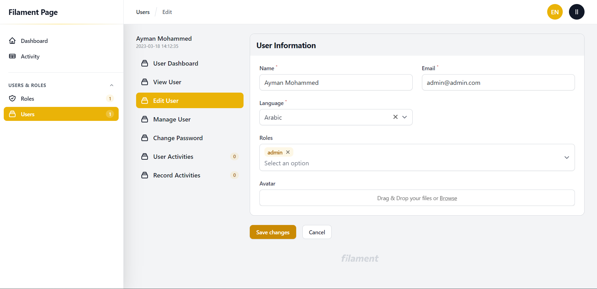

# Filament Page With Sidebar

Organize resource pages in sidebar in order to make navigation between resource pages more confort


## Screenshots
LTR (Left to Right)


RTL (Right to Left)


This package only for [Filament Admin Panel](https://filamentphp.com/)

## Installation
```bash
$ composer require aymanalhattami/filament-page-with-sidebar
```
## Usage
1. First you need to prepare resource pages, for example we have edit page, view page, manage page, change password page and dashboar page for UserResource
```php
use Filament\Resources\Resource;

class UserResource extends Resource 
{
    // ...

    public static function getPages(): array
    {
        return [
            'index' => App\Filament\Resources\UserResource\Pages\ListUsers::route('/'),
            'edit' => App\Filament\Resources\UserResource\Pages\EditUser::route('/{record}/edit'),
            'view' => App\Filament\Resources\UserResource\Pages\ViewUser::route('/{record}/view'),
            'manage' => App\Filament\Resources\UserResource\Pages\ManageUser::route('/{record}/manage'),
            'password.change' => App\Filament\Resources\UserResource\Pages\ChangePasswordUser::route('/{record}/password/change'),
            'dashboard' => App\Filament\Resources\UserResource\Pages\DashboardUser::route('/{record}/dashboard'),
            // ... more pages
        ];
    }

    // ...
}
```

2. Define a $record property in each custom page, example

```php
public ModelName $record;
```

3. Then, define sidebar method as static in the resource
```php
use Illuminate\Database\Eloquent\Model;
use Filament\Resources\Resource;
use AymanAlhattami\FilamentPageWithSidebar\FilamentPageSidebar;
use AymanAlhattami\FilamentPageWithSidebar\PageNavigationItem;

class UserResource extends Resource 
{
    // ....

    public static function sidebar(Model $record): FilamentPageSidebar
    {
        return FilamentPageSidebar::make()
            ->setNavigationItems([
                PageNavigationItem::make('User Dashboard')
                    ->url(function () use ($record) {
                        return static::getUrl('dashboard', ['record' => $record->id]);
                    }),
                PageNavigationItem::make('View User')
                    ->url(function () use ($record) {
                        return static::getUrl('view', ['record' => $record->id]);
                    }),
                PageNavigationItem::make('Edit User')
                    ->url(function () use ($record) {
                        return static::getUrl('edit', ['record' => $record->id]);
                    }),
                PageNavigationItem::make('Manage User')
                    ->url(function () use ($record) {
                        return static::getUrl('manage', ['record' => $record->id]);
                    }),
                PageNavigationItem::make('Change Password')
                    ->url(function () use ($record) {
                        return static::getUrl('password.change', ['record' => $record->id]);
                    }),

                // ... more items
            ]);
    }

    // ....
}
```

4. Use x-filament-page-with-sidebar::page component in page blade file as wrapper for the whole content
```php
// filament.resources.user-resource.pages.change-password-user
<x-filament-page-with-sidebar::page>
    // ... page content
</x-filament-page-with-sidebar::page>

```

## More Options
You can set title or description by using setTitle and setDescription methods for the sidebar that will at the begaining of sidebar on the top, example 
```php
// ...

public static function sidebar(Model $record): FilamentPageSidebar
{
    return FilamentPageSidebar::make()
        ->setTitle('Sidebar title')
        ->setDescription('Sidebar description')
        ->setNavigationItems([
            PageNavigationItem::make(__('User Dashboard'))
                ->url(function () use ($record) {
                    return static::getUrl('dashboard', ['record' => $record->id]);
                }),
            PageNavigationItem::make(__('View User'))
                ->url(function () use ($record) {
                    return static::getUrl('view', ['record' => $record->id]);
                }),

            // ... more items
        ]);
}

// ...
```

You can add icon to the item by using icon method, example 
```php
// ...

public static function sidebar(Model $record): FilamentPageSidebar
{
    return FilamentPageSidebar::make()
        ->setNavigationItems([
            PageNavigationItem::make('Change Password')
                ->url(function () use ($record) {
                    return static::getUrl('password.change', ['record' => $record->id]);
                })->icon('heroicon-o-collection')

            // ... more items
        ]);
}

// ...
```

You can make item active "has different background color" by using isActiveWhen method, example 
```php
// ...
public static function sidebar(Model $record): FilamentPageSidebar
{
    return FilamentPageSidebar::make()
        ->setNavigationItems([
            PageNavigationItem::make('Change Password')
                ->url(function () use ($record) {
                    return static::getUrl('password.change', ['record' => $record->id]);
                })
                ->isActiveWhen(function () {
                    return request()->route()->action['as'] == 'filament.resources.users.password.change';
                })
            // ... more items
        ]);
}
// ...
```

You can hide item from sidebar by using isHiddenWhen method, example 
```php
// ...

public static function sidebar(Model $record): FilamentPageSidebar
{
    return FilamentPageSidebar::make()
        ->setNavigationItems([
            PageNavigationItem::make('Change Password')
                ->url(function () use ($record) {
                    return static::getUrl('password.change', ['record' => $record->id]);
                })
                ->isHiddenWhen(false)
            // ... more items
        ]);
}
    ,
// ...
```

You can add badge to the item by using badge method, example 
```php
// ...
public static function sidebar(Model $record): FilamentPageSidebar
{
    return FilamentPageSidebar::make()
        ->setNavigationItems([
            PageNavigationItem::make('Change Password')
                ->url(function () use ($record) {
                    return static::getUrl('password.change', ['record' => $record->id]);
                })
                ->badge("badge name")
            // ... more items
        ]);
}
    ,
// ...
```

Project Demo Link
https://github.com/aymanalhattami/filament-page-with-sidebar-project